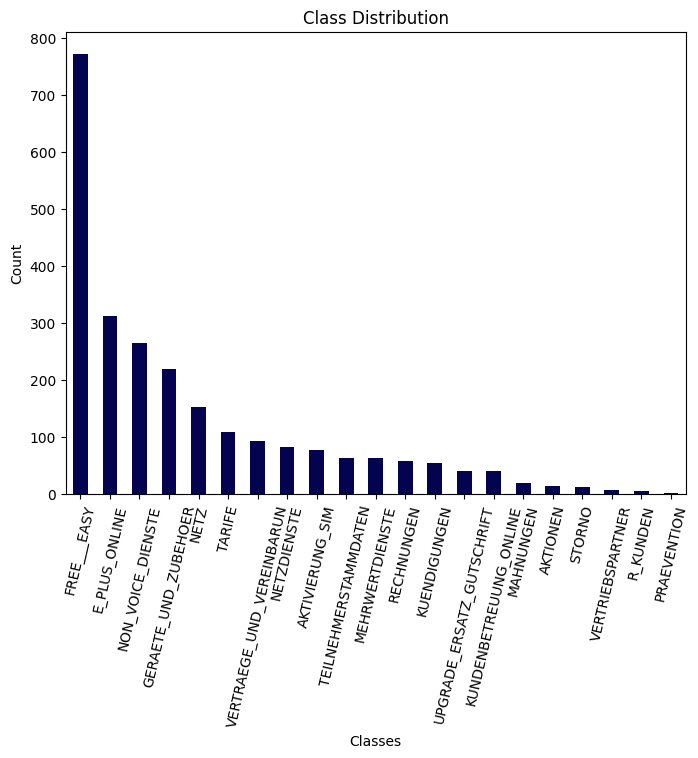

# Text classification using Flair NLP framework 

Flair is an NLP framework developed by Humboldt University of Berlin. It is build on top of PyTorch. It also allows easy integration of different word embeddings into the project. 

## Run the program
### Using pipenv 

```shell
$ ls 
flair                              full_dataset.csv  README.md         streamlit_app.py  training_scipt.py
flair_emails_classification.ipynb  metadata          requirements.txt  text_cleaning.py

$ python3 -m venv flair_classification 

$ source flair_classification/bin/activate 

$ pip install -r requirements.txt

$ python3 training_script.py    # saves the model to flair/model/

$ streamlit run streamlit_app.py


```

## Encoding issues 
After initial text processing and dataset generation, most of the emails were correctly decoded, however, some were still broken.

Example of an incorrectly decoded email:
```
Ich bitte Sie mir kurzfristig schriftlich mitzuteilen, ob Sie auch mir als 
=
Bestandskunden aus dem =F6ffentlichen Dienst den Time & More 60 Tarif zum 
P=
auschalpreis von 26,25 DM anbieten k=F6nnen.
```
The same email fragment after using decode method of the quopri package:
```
Ich bitte Sie mir kurzfristig schriftlich mitzuteilen, ob Sie auch mir als 
Bestandskunden aus dem öffentlichen Dienst den Time & More 60 Tarif zum 
Pauschalpreis von 26,25 DM anbieten können.
```

Code:
``` python
import quopri

encoded_text = df['Content'][1]
decoded_text = quopri.decodestring(encoded_text).decode('iso-8859-1')

print(decoded_text)
```

## Data
The dataset we used (full_dataset.csv) contains 2448 emails belonging to 21 different categories. The dataset is extremely imbalanced, with the most populous category having 772 emails, while the smallest category having only one email.<br>




## Text processing 
For data processing we used pre-defined functions contained in the text_cleaning.py file 
The first function fetch_body is emant to extract the meaningful part of the email, the email body:
```python 
def fetch_body(text):
    my_text = text.split('Nachricht      : ')[-1]
    text =  my_text.split('--')[0]
    return text.replace('\n', ' ')
```
The second function prrprocess_text is specifically for text cleaning and normalization:
```python
def preprocess_text(text):
    text = text.lower()
    text = re.sub(r'^a-zäöüß0-9\s', '', text)
    text = re.sub(r'\s', ' ', text).strip()
    doc = de_nlp(text)
    no_stopwords_sent = [str(word.lemma_).lower() for word in doc if not word.is_stop]
    text = ' '.join(no_stopwords_sent)
    text = re.sub('--', '', text.replace('\n', ''))
    text = re.sub(' +', ' ', text)
    return text  
```
As an alternative, clean-text library could be used. It is designed for two languages: English and German. 
```python 
from cleantext import clean

clean("some input",
    fix_unicode=True,               # fix various unicode errors
    to_ascii=True,                  # transliterate to closest ASCII representation
    lower=True,                     # lowercase text
    no_line_breaks=False,           # fully strip line breaks as opposed to only normalizing them
    no_urls=False,                  # replace all URLs with a special token
    no_emails=False,                # replace all email addresses with a special token
    no_phone_numbers=False,         # replace all phone numbers with a special token
    no_numbers=False,               # replace all numbers with a special token
    no_digits=False,                # replace all digits with a special token
    no_currency_symbols=False,      # replace all currency symbols with a special token
    no_punct=False,                 # remove punctuations
    replace_with_punct="",          # instead of removing punctuations you may replace them
    replace_with_url="<URL>",
    replace_with_email="<EMAIL>",
    replace_with_phone_number="<PHONE>",
    replace_with_number="<NUMBER>",
    replace_with_digit="0",
    replace_with_currency_symbol="<CUR>",
    lang="en"                       # set to 'de' for German special handling
)
```
## Dataset for Flair
Just like other frameworks, Flair has some conventions which you should stick with. For instance, each label (email category) must be represented numerically, so our 21 categories turn into numbers [0, 20]. We store them in a column 'label' using __label__ keyword before each number. For example, category "R_Kunden" was encoded as __label__14. Also, we create a column 'label_text' and store our texts there with their corresponding labels preceding them like this: 
```text
__label__14 bekannt gehören angehoerig oeffent...
```
After this and train/val/test split is done, we oversample the training data so each email class has the same number of emails in the dataset. 
Result of oversampling:
```
AKTIVIERUNG_SIM              493
NETZDIENSTE                  493
PRAEVENTION                  493
VERTRIEBSPARTNER             493
R_KUNDEN                     493
KUNDENBETREUUNG_ONLINE       493
AKTIONEN                     493
TEILNEHMERSTAMMDATEN         493
VERTRAEGE_UND_VEREINBARUN    493
STORNO                       493
NETZ                         493
UPGRADE_ERSATZ_GUTSCHRIFT    493
MEHRWERTDIENSTE              493
NON_VOICE_DIENSTE            493
RECHNUNGEN                   493
E_PLUS_ONLINE                493
FREE___EASY                  493
KUENDIGUNGEN                 493
GERAETE_UND_ZUBEHOER         493
TARIFE                       493
MAHNUNGEN                    493
Name: Category, dtype: int64
```
Training, validation, and testing data must be saved as train.txt, valid.txt (or dev.txt), and test.txt, respectively. Otherwise, the Flair model won't be able to detect them in the directory.  

## Flair Model Training
To train the Flair model, we need to specify the text corpus and the classifier.
Corpus is created using ClassificationCorpus class and consists of our train/val/test data. Classifier is created using word embeddings, label dictionary and label type (label type is basically the label column of our DataFrame). 
The model is trained using the following hyperparameters:
```python
embeddings_storage_mode='gpu',
learning_rate=0.005,
mini_batch_size=16,
mini_batch_chunk_size=4,
max_epochs=10
```
Initially, inbuilt Flair method for handling data imbalance was used (ImbalancedClassificationDatasetSampler), but the model trained without it showed a slightly better performance.

## Model Performance
```
By class:
              precision    recall  f1-score   support

           3     0.7086    0.7985    0.7509       134
           2     0.5538    0.6207    0.5854        58
          11     0.5000    0.4902    0.4950        51
           4     0.5400    0.6585    0.5934        41
           9     0.5517    0.5161    0.5333        31
          16     0.4000    0.4706    0.4324        17
          10     0.5385    0.4375    0.4828        16
           8     0.4167    0.3846    0.4000        13
          19     0.5000    0.2353    0.3200        17
          17     0.9091    0.7692    0.8333        13
           1     0.5000    0.3571    0.4167        14
          13     0.1667    0.2222    0.1905         9
           5     0.7778    0.6364    0.7000        11
           6     0.0000    0.0000    0.0000         7
          18     0.0000    0.0000    0.0000         7
           7     0.0000    0.0000    0.0000         4
           0     0.0000    0.0000    0.0000         2
          15     1.0000    0.5000    0.6667         2
          20     0.0000    0.0000    0.0000         1

    accuracy                         0.5804       448
```
Overall accuracy of the model on the test set is 58%.
Some classes have been ignored by the model:
<ul>
<li>VERTRIEBSPARTNER
<li>AKTIONEN
<li>KUNDENBETREUUNG_ONLINE
<li>MAHNUNGEN
<li>UPGRADE_ERSATZ_GUTSCHRIFT
</ul>
All of these classes are the ones with the least data. 

## Possible Improvements 
<ol>
<li> Text augmentation techniques
<li> Other pretrained models for few-shot classification
<li> Other oversampling techniques
</ol>