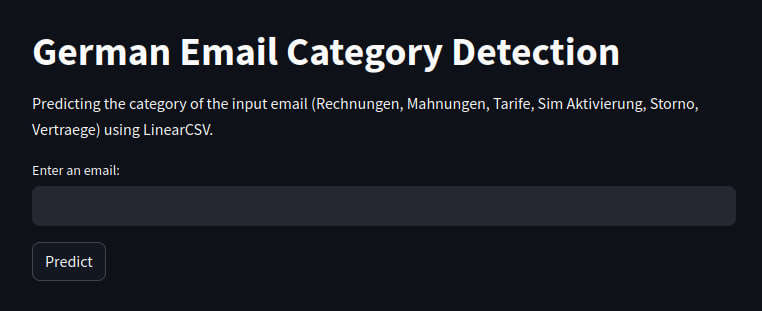
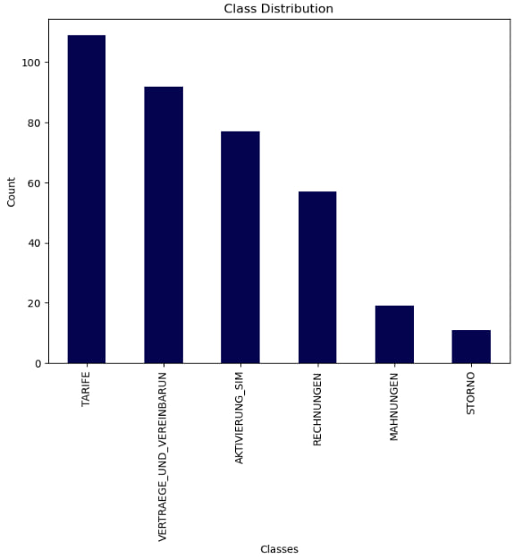
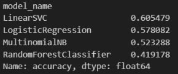
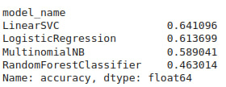

# Text classification using traditional ML algorithms 
In this project, we use traditional ML algorithms (SVM, Logistic Regression, Random forest, and MultnominalNB) for text classification, specifically, email categorization, to find out which method is the most effective one. 

## Project structure
| Item  | Description  |
|---|---|
| metadata/ | Contains metadata used in README. |
| Dockerfile | Script for project deployment using Docker. |
| traditional_ml.ipynb | Notebook with code snippets for data processing and text classification. |
| short_dataset.csv | Dataset in its initial form (.csv format). Contains unprocessed emails belonging to 6 categories. |
| requirements.txt | Packages to install in order to run the program.  |
| deploy_streamlit.py | Web application with model inference. |
| text_cleaning.py | Python script containing functions for email body extraction (fetch_body) and text preprocessing (preprocess_text). |
| linear_svc_classifier.py | Python script for data processing and classifier creation which will be used in inference. |
| README.md | Overview of the project.  |


```
traditional_ml_approach/
├── deploy_streamlit.py
├── Dockerfile
├── linear_svc_classifier.py
├── metadata/
│   ├── accuracy_no_preprocessing.jpg
│   ├── accuracy_with_preprocessing.jpg
│   └── data_distribution.jpg
├── README.md
├── requirements.txt
├── short_dataset.csv
├── text_cleaning.py
└── traditional_ml.ipynb
```
## Run the program 
### Using Dockerfile
```shell
$ docker build . -t emails_svc_classifier

$ docker images 
REPOSITORY                                                         TAG                         IMAGE ID       CREATED         SIZE
emails_svc_classifier                                              latest                      039f5ad39416   3 minutes ago   929MB

$ docker run --rm -it -p 8888:8888 emails_svc_classifier

Collecting usage statistics. To deactivate, set browser.gatherUsageStats to False.


  You can now view your Streamlit app in your browser.

  Network URL: http://172.17.0.2:8501
  External URL: http://195.225.49.158:8501

```

## Streamlit app interface 



## Data 
Dataset contains 365 emails nbelonging to 6 different classes:
<ol>
<li> Tarife
<li> Rechnungen 
<li> Mahnungen 
<li> Vertraege und Vereinbarungen 
<li> Storno 
<li> Aktivierung Sim 
</ol>




## Performance
Without any preprocessing, traditional ML methods already showed some results, with LinearSVC producing the best ones: <br>
 

After applying some preprocessing techniques (stopwords removal, lowercase conversion, lemmatization) the accuracies rose for all algorithms (4.5% improvement on average): <br>
