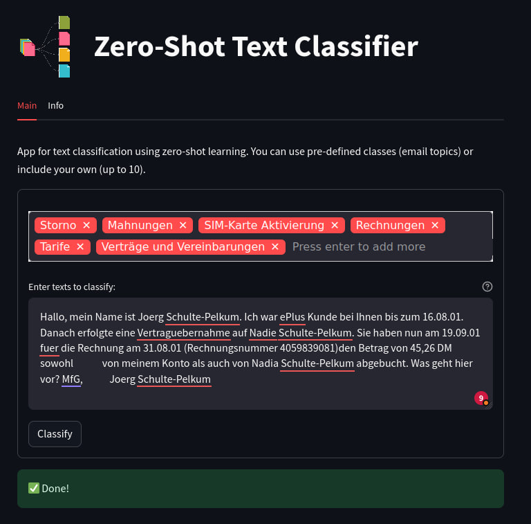
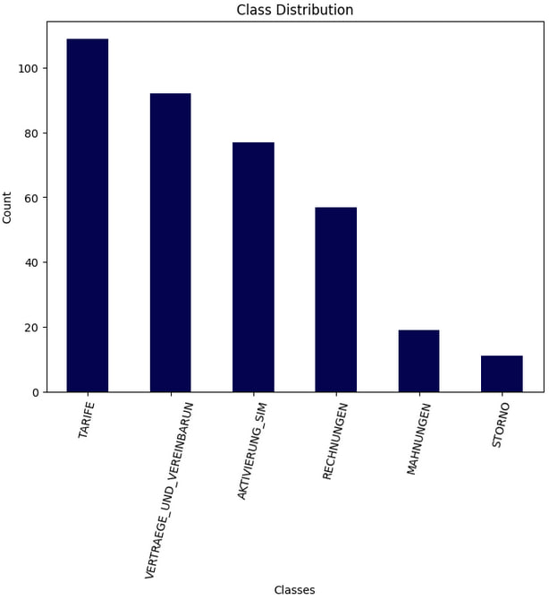

# Zero-shot email classification 
<b>Zero-shot classification</b> is a machine learning approach in which a model can classify data into multiple classes without any specific training examples for those classes. In traditional supervised learning, a model is trained on a labelled dataset with examples for each category it needs to classify. However, the model can generalize to new classes it has never seen during training in zero-shot classification.

## Project structure 
| Item  | Description  |
|---|---|
| metadata/ | Folder containing image data used in README file as well as streamlit web application.  |
| Dockerfile | File for deploying streamlit web application using Docker. |
| requirements.txt | Packages used in the project.  |
| short_dataset.csv | Data used in research (zero_shot_classification_emails.ipynb).  |
| zero_shot_classification_emails.ippynb | Notebook with research. Used for testing different LLMs in zero-shot text classification task. |
| streamlit_app.py | Zero-shot text classifier deployed as a streamlit web application.  |
|  README.md | Overview of the project.  |

```tree
zero_shot_classification/
├── Dockerfile
├── metadata/
│   ├── data_distirbution.jpg
│   ├── logo-hugging-face.png
│   ├── text-classification.png
│   └── web-app_interface.jpg
├── README.md
├── requirements.txt
├── short_dataset.csv
├── streamlit_app.py
└── zero_shot_classification_emails.ipynb
```
## Run the program 

### Streamlit Cloud 
This app was uploaded to the Streamlit Cloud and can be easily accessed via this link: https://zero-shot-text-classifier-bart.streamlit.app/

To classify texts using this app, you should have a HuggingFace account. If you don't have one, register <a href="https://huggingface.co/">here</a>. Once you've done it, go to the <a href="https://huggingface.co/settings/tokens">settings</a> and generate Access Token. Now, open a sidebar of the app and write the key you've just generated. Now, you can set the labels and perform zero-shot text classification. For more information about the app open the 'Info' tab.

If you will to play around the project locally you may use Docker.

### Docker 
```shell
$ docker build . -t zero-shot

$ docker images 
REPOSITORY                                                         TAG                         IMAGE ID       CREATED         SIZE
zero-shot                                                          latest                      985714a24116   5 seconds ago   833MB

$ docker run --rm -it -p 8888:8888 zero-shot

Collecting usage statistics. To deactivate, set browser.gatherUsageStats to False.


  You can now view your Streamlit app in your browser.

  Network URL: http://172.17.0.2:8501
  External URL: http://195.225.49.158:8501

```
### Web App Interface Preview


## Data 
To check the performance of different models, we use the short version of emails dataset containing 365 emails belonging to 6 different categories.

<b>Categories</b>:
<ol> 
<li>Rechnungen
<li> Storno
<li> Mahnungen 
<li> Tarife
<li> Aktivierung Sim
<li> Vertraege und Vereinbarung
</ol>

Data disribution by classes:



## Data processing 
1. <b>Emails decoding</b> using latin-1 encoding. It allows to decode German special characters (vowels with diacritics and ß) correctly.
2. <b>Email content extraction</b> 

All emails have similar structure
For example, consider the email below: 

```
An:	KUNDENSERVICE@EPLUS
Kopie:	 
Datum:	29.10.2001 19:18:59
Betreff:	E-Mail Beantwortung

Anrede         : Frau
Name           : Stephanie Dallmann
Handyrufnummer : 49 177 3842820
Account Nummer :
Handymodell    : Nokia 3310
Provider       : E-Plus Service
Email          : sdallmann@web.de
-------------------------------------
Nachricht      : Sehr geehrtes E-Plus Team,
in welchem Ihrer Tarife ist die automatische Rufumleitung auf ein anders 
Handy kostenfrei?
Mit freundlichen Grüßen
Dallmann Stephanie
-------------------------------------
--443437766.1004379539411.JavaMail.nsuser@apps1mn1--

```
The email body - the message itself - starts after the word 'Nachricht' and ends before multiple dash characters. We define a function <em>fetch_body</em> which will extract text between these two sets of characters using inbuilt Python split method.

```python
import re

# function to fetch the email body
def fetch_body(text: str):
    """
    Takes email, extracts the email body and cleans it by normalizing spaces.

    Args: 
      text (str): raw email text. 

    Returns:
      text (str): email body with no newlines and extra spaces.
    """

    text = text.split("Nachricht      : ")[-1]
    text = text.split("--")[0]
    text = re.sub("\n", " ", text)
    text = re.sub(" +", " ", text)
    text = re.sub(r"\s+([.,!?])", r"\1", text)
    return text.strip()

df['Email_body'] = df['Content_fixed'].apply(fetch_body)
```
Also the function normalizes the spaces: newlines are replaced with single spaces, multiple spaces are replaced with single spaces, the space is also added after some punctuation marks (exclamation mark, question mark, comma, period). 

Now, texts are human-readable and normalized:
```
Sehr geehrtes E-Plus Team, in welchem Ihrer Tarife ist die automatische Rufumleitung auf ein anders Handy kostenfrei? Mit freundlichen Grüßen Dallmann Stephanie
```
We don't need any furhter preprocessing as zero-shot classification requires simple human-readable texts as they are. 

## Models 

We used 5 different models for the task: two BERT-based, two BART-based and one GPT-based

| Model  | Base model  | Description  | 
|---|---|---|
| bart-large-mnli  | BART (bart-large) | Trained on the MultiNLI (MNLI) Dataset. Multilingual.  | 
| DistilBart-MNLI  | BART (bart-large) | Trained on the MultiNLI (MNLI) Dataset. Multilingual.  | 
| German_Zeroshot | BERT (gbert-large)  |  Monolingual (German) | 
| gbert-large-zeroshot-nli   |  BERT (gbert-large) | Monolingual (German)  | 
| german-gpt2  | GPT-2 | Monolingual (German) | 

## Performance 

The first 4 models showed similar performance reaching approximately 50% accuracy without any additional techniques applied. The big problem when using zero-shot classification is appropriate class description. German-Zeroshot model initially couldn't capture the "Aktivierung der SIM-Karte" class and completely ignored them mislassifying it either as "Tarif" or "Vertraeg". After I changed the class description to "Sim-Karten-Aktivierung" it started working.

Also, model often overfits towards more general classes like "Tarif" and "Vertraeg" ignoring more specific classes ctageories like "Mahnungen" or "Storno". Technically, both Vertraeg and Storno refer to contracts, but the first one is about concluding a contract, while the other one is about contract cancellation.

Using more specific class names could benefit us in this case. Therefore, I tried out using synonyms for class description. As for now, I tried synonyms approach for 2 models: bart-large-mnli and gbert-large-zeroshot-nli. The second one didn't show any improvement, the best performance it showed was 51% without any additional fine-tuning. After using synonyms the performance dropped to 40s. However, I played around with synonyms for the BART model, and the performance rose by 7%. Initial accuracy was 41% and eventually I reached the mark of 48% 

The synonyms I used:

```python
labels_with_synonyms = {
    "Rechnungen": ["Rechnungen", "Fakturen", "Abrechnung", "Monatsabrechnung"],
    "SIM-Karte Aktivierung": ["SIM-Karte Aktivierung", "SIM-Aktivierung", "Freischaltung von SIM-Karten", "SIM-Karte Deaktivierung"],
    "Storno": [ "Abbruch", "Storno", "Vertragskündigung", "Vertragsauflösung", "Auftragsstornierung"],
    "Verträge und Vereinbarungen": ["Vertragsabschluss", "Vertrag oder Vereinbarung", "Vertrag", "Kontrakt"], 
    "Tarife": ["Tarifvergleich", "Tarifdetails", "Tarifänderung", "Tarifplan", "Tarif"],
    "Mahnungen": ["Mahnung", "Mahnbescheid", "Zahlungserinnerung"] 
}
```

For the final application, I used bart-large-mnli model. It showed good results when using synonyms and multi-label classification. Also, it's a good practice to make NLP apps universal for many languages. German_Zeroshot and gbert-large-zeroshot-nli performed well, but they are monolingual. 